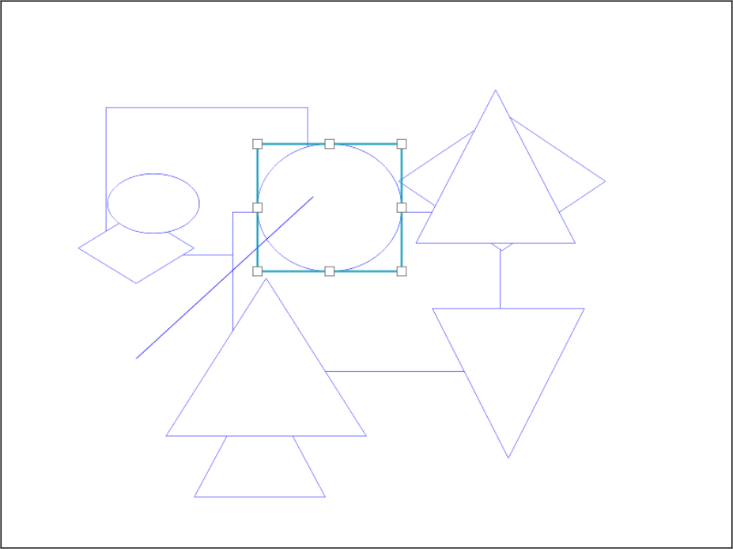

# gambar


[](https://github.com/jtanadi/gambar/blob/master/LICENSE.md)
[](https://github.com/jtanadi/gambar/issues)

Gambar is a small drawing library written in Typescript. The library provides a thin, consistent, layer on top of some basic Canvas API methods.
Gambar doesn't aim to be comprehensive, but rather, to provide convenience when implementing a drawing app with limited scope.

The name is Indonesian and translates to *picture*, *drawing*, or *to draw*.



## API
### Getting Started
To start, create a new instance of `Gambar` and pass in your `canvas` element. `Gambar`'s constructor also accepts an optional parameter, `boundingBoxStyle`, in case the library is used in an interactive drawing app.
```javascript
const canvas = document.querySelector("canvas")
const gambar = new Gambar(canvas)

// Also possible
const boundingBoxStyle = {
    bBoxNodeStyle,
    bBoxEdgeStyle,
}
const gambar = new Gambar(canvas, boundingBoxStyle)
```

### Creating Shapes
#### rectangle(pt0: Point, pt1: Point, style: StyleProps, save = true)
#### ellipse(pt0: Point, pt1: Point, style: StyleProps, save = true)
#### line(pt0: Point, pt1: Point, style: StyleProps, save = true)
Most shapes have the same signature: `shape(startPt, endPt, style)`.

`startPt` and `endPt` are `Point` objects with `{x, y}` members. 

`style` is a `StyleProps` object with `{strokeColor, strokeWidth, fillColor}` optional members.

When `save` is `false`, the shape is only drawn temporarily and won't be pushed onto the `shapes` stack.

```javascript
gambar.rectangle(
  {x: 100, y: 100},
  {x: 200, y: 150},
  {strokeColor: "red", strokeWidth: 2, fillColor: "white"})

gambar.ellipse(startPt, endPt, style)
gambar.line(startPt, endPt, style)
```

#### polygon(points: Point[], style: StyleProps, save = true)
The `polygon` method creates an arbitrary polygon and takes an array of `Point` objects and a `style` object.

```javascript
gambar.polygon(
  [
    {x: 10, y: 20},
    {x: 100, y: 200},
    {x: 50, y: 100}
  ],
  {strokeColor: "blue", strokeWidth: 3}
)
```

### Other Methods
#### `render()`
Forces the entire canvas to be re-rendered. This method is called by methods that affect the canvas (eg. drawing methods).

#### `deleteAll()`
Delete all shapes in memory.

#### `deleteShape(shape: Shape)`
Delete specified shape.

#### `clearSelection()`
Deselects all shapes.

#### `selectShapeAtPoint(point: Point, clearSelection = true)`
Select the top-most shape that intersects the `point` (ie. pointer location).

#### `findShapeAtPoint(point: Point)`
Find the top-most shape that intersects the `point`. This method doesn't actually select the shape, but returns it.

#### `pushSelectedShapesBackward()`
Push the selected shapes further down the layer stack.

#### `pullSelectedShapesForward()`
Pull the selected shapes up the layer stack.

#### `moveSelectedShapes(delta: Point)`
Move selected shapes by `delta`. For example, if shape's origin is at `(10, 20)` and `delta` is `(100, 50)`, then the shape's new origin will be `(110, 70)`.

#### `loadStack(shapes: Shape[])`
Load the drawing `shapes` stack.

#### `getShapeStack()`
Get the drawing `shapes` stack

#### `getDrawingData()`
Return the canvas' `dataURL`

